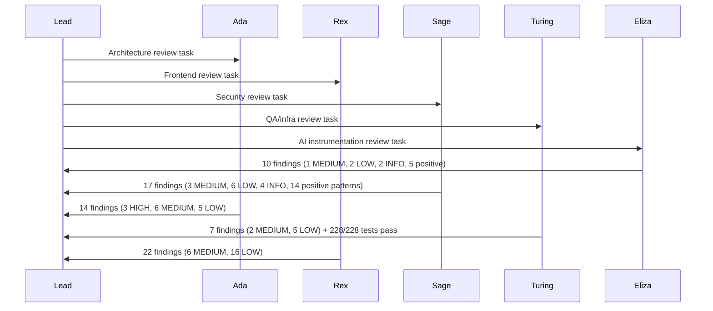
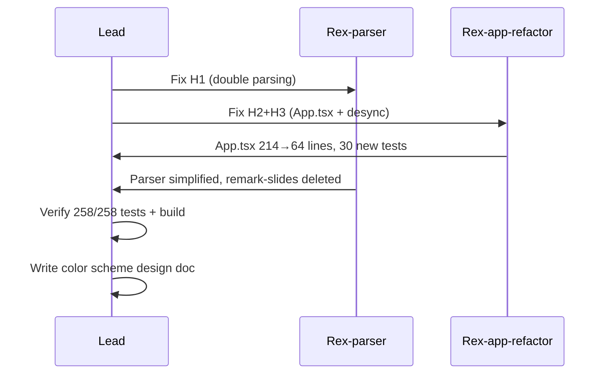

# Team Execution Log

> Maintained by team lead. Records every team session with interaction summaries and diagrams.
> **Retention: last 20 invocations only.** Delete the oldest when adding #21.

---

## Invocation #1 — 2026-02-26 10:00 — "Full team review of project state"

### Interactions
| Time | Summary |
|------|---------|
| 10:00 | Lead created team and initialized execution log |
| 10:01 | Lead dispatched Ada for architecture review |
| 10:01 | Lead dispatched Rex for frontend review |
| 10:01 | Lead dispatched Sage for security review |
| 10:01 | Lead dispatched Turing for QA review |
| 10:01 | Lead dispatched Eliza for AI instrumentation review |
| 10:15 | Eliza → team-lead: Comprehensive AI instrumentation review findings |
| 10:18 | Sage → Lead: Completed comprehensive security audit with 17 findings |
| 10:20 | Ada → Lead: Architecture review complete — 14 findings across 4 severity levels |
| 10:35 | Turing → Lead: QA/infra review complete — 228 tests pass, 7 findings |
| 10:38 | Rex → Lead: Frontend review complete — 22 findings, 6 medium, 0 critical |
| 10:38 | Lead shut down Eliza and Turing (reviews complete) |
| 10:40 | Lead received Ada and Sage reports, shut down Rex, Ada, Sage |
| 10:41 | Lead compiled consolidated report and finalized session |

### Diagram

## Invocation #2 — 2026-02-26 10:45 — "Fix 3 HIGH priority architecture findings"

### Interactions
| Time | Summary |
|------|---------|
| 10:45 | Lead created team and initialized execution log for fix session |
| 10:46 | Lead dispatched Rex-parser to fix H1 (double markdown parsing) |
| 10:46 | Lead dispatched Rex-app-refactor to fix H2+H3 (App.tsx refactor + route/state desync) |
| 11:10 | Rex-app-refactor → Lead: App.tsx refactored 214→64 lines, 4 hooks, desync fixed, 258 tests pass |
| 11:15 | Rex-parser → Lead: Parser simplified, remark-slides deleted, 258 tests pass |
| 11:20 | Lead verified 258/258 tests pass + build succeeds |
| 11:25 | Lead wrote color scheme redesign design doc |
| 11:30 | Lead committed all changes |

### Diagram

