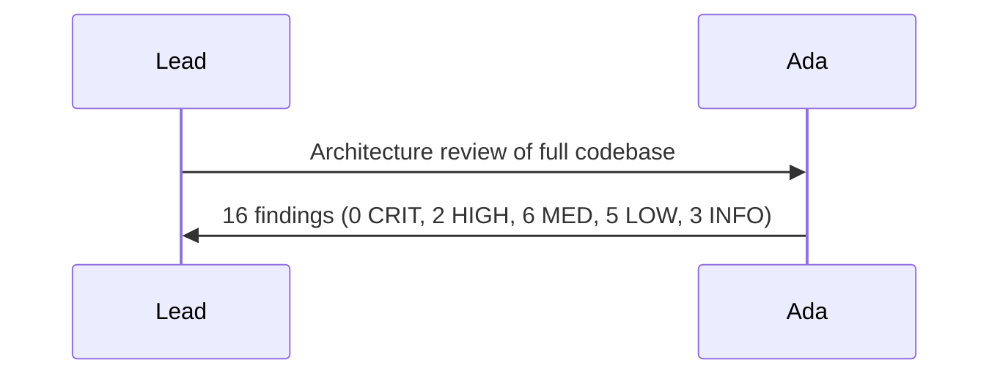
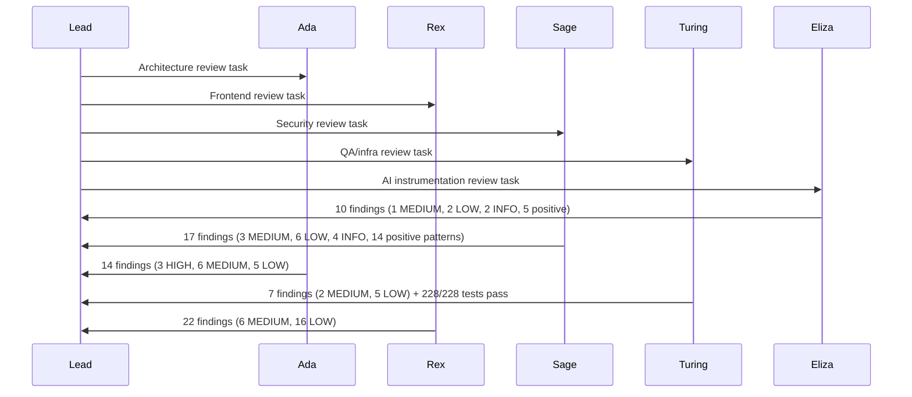
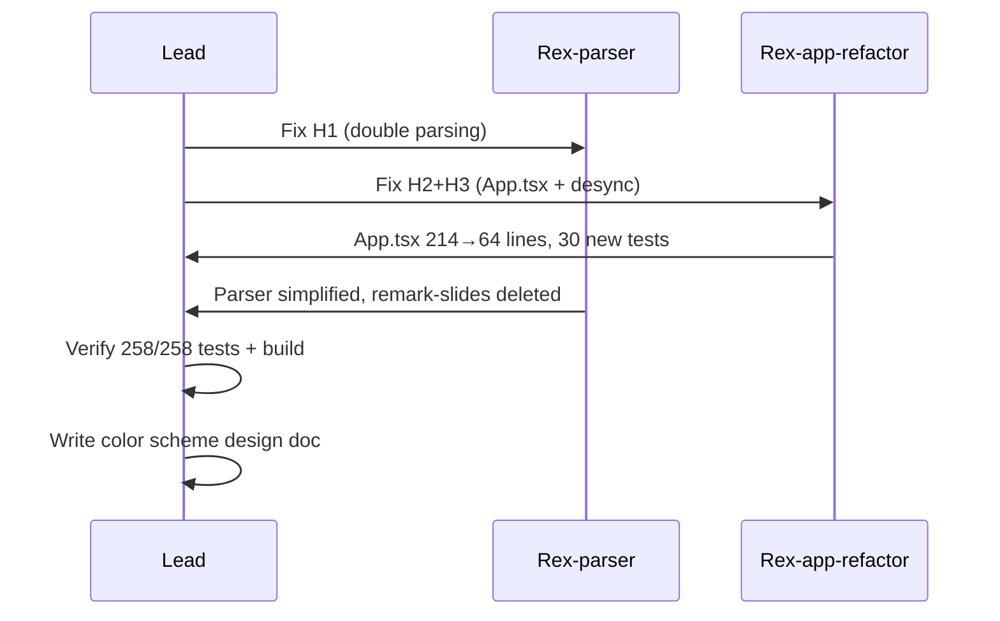
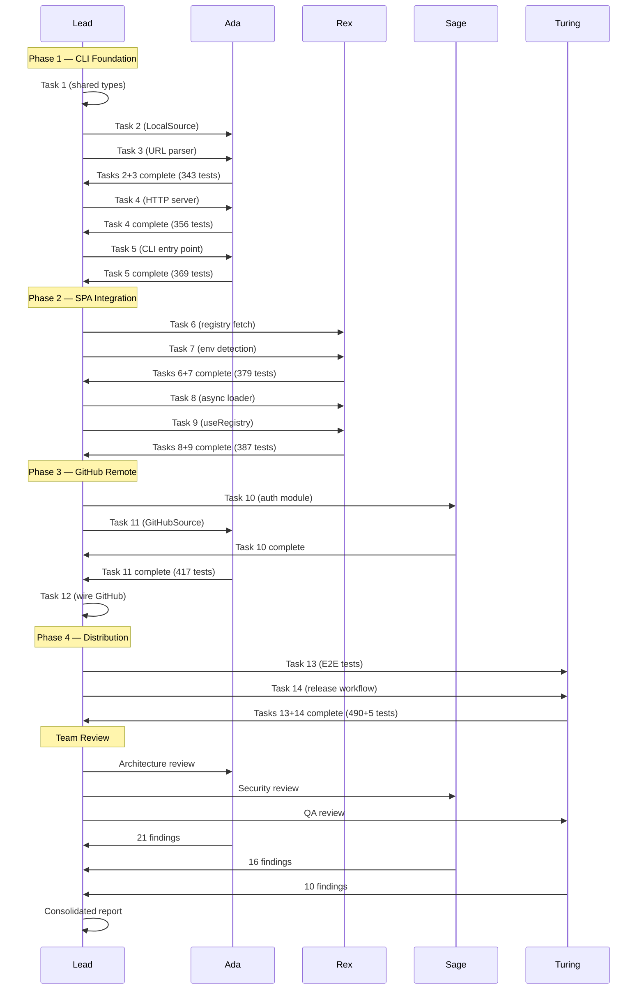
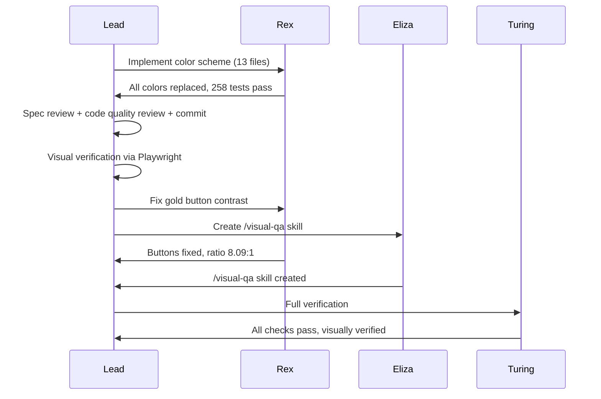

# Team Execution Log

> Maintained by team lead. Records every team session with interaction summaries and diagrams.
> **Retention: last 20 invocations only.** Delete the oldest when adding #21.

---

## Invocation #2 — 2026-03-10 — "Full team review of project state"

### Interactions
| Time | Summary |
|------|---------|
| -- | Ada → team-lead: Architecture review complete — 16 findings, 0 critical, 2 high |
| -- | Eliza → team-lead: Blocked — CLI/Homebrew design doc not found, providing general review |
| -- | Eliza → team-lead: Background agent message loss findings and recommendations |
| -- | Rex → team-lead: Frontend review complete — 14 findings, 0 critical, 2 high |
| -- | Sage → team-lead: Security review complete — 12 findings, 0 crit, 2 high |
| -- | Sage → team-lead: Comprehensive security review — 5 med, 4 low, 6 info |
| 00:00 | Sage → team-lead: Full security audit — 15 findings, 0 crit, 2 high |
| -- | Ada → team-lead: Architecture review — 14 findings, 0 CRIT, 2 HIGH |
| 00:00 | Ada → team-lead: Architecture review complete — 18 findings across 5 severity levels |
| 00:00 | Rex → team-lead: Frontend review — 20 findings, 0 crit, 2 high |

### Diagram

```mermaid
sequenceDiagram
    participant Lead
    participant Ada
    Lead->>Ada: Architecture review of full codebase
    Ada->>Lead: 16 findings (0 CRIT, 2 HIGH, 6 MED, 5 LOW, 3 INFO)
```

---

## Invocation #1 — 2026-02-26 10:00 — "Full team review of project state"

### Interactions
| Time | Summary |
|------|---------|
| 10:00 | Lead created team and initialized execution log |
| 10:01 | Lead dispatched Ada for architecture review |
| 10:01 | Lead dispatched Rex for frontend review |
| 10:01 | Lead dispatched Sage for security review |
| 10:01 | Lead dispatched Turing for QA review |
| 10:01 | Lead dispatched Eliza for AI instrumentation review |
| 10:15 | Eliza → team-lead: Comprehensive AI instrumentation review findings |
| 10:18 | Sage → Lead: Completed comprehensive security audit with 17 findings |
| 10:20 | Ada → Lead: Architecture review complete — 14 findings across 4 severity levels |
| 10:35 | Turing → Lead: QA/infra review complete — 228 tests pass, 7 findings |
| 10:38 | Rex → Lead: Frontend review complete — 22 findings, 6 medium, 0 critical |
| 10:38 | Lead shut down Eliza and Turing (reviews complete) |
| 10:40 | Lead received Ada and Sage reports, shut down Rex, Ada, Sage |
| 10:41 | Lead compiled consolidated report and finalized session |

### Diagram

```mermaid
sequenceDiagram
    participant Lead
    participant Ada
    participant Rex
    participant Sage
    participant Turing
    participant Eliza
    Lead->>Ada: Architecture review task #1
    Lead->>Rex: Frontend review task #2
    Lead->>Sage: Security review task #3
    Lead->>Turing: QA/infra review task #4
    Lead->>Eliza: AI instrumentation review task #5
    Eliza->>Lead: 10 findings (1 MEDIUM, 2 LOW, 2 INFO, 5 positive)
    Sage->>Lead: 17 findings (3 MEDIUM, 6 LOW, 4 INFO, 14 positive patterns)
    Ada->>Lead: 14 findings (3 HIGH, 6 MEDIUM, 5 LOW)
    Turing->>Lead: 7 findings (2 MEDIUM, 5 LOW) + 228/228 tests pass
    Rex->>Lead: 22 findings (6 MEDIUM, 16 LOW)
```

## Invocation #2 — 2026-02-26 10:45 — "Fix 3 HIGH priority architecture findings"

### Interactions
| Time | Summary |
|------|---------|
| 10:45 | Lead created team and initialized execution log for fix session |
| 10:46 | Lead dispatched Rex-parser to fix H1 (double markdown parsing) |
| 10:46 | Lead dispatched Rex-app-refactor to fix H2+H3 (App.tsx refactor + route/state desync) |
| 11:10 | Rex-app-refactor → Lead: App.tsx refactored 214→64 lines, 4 hooks, desync fixed, 258 tests pass |
| 11:15 | Rex-parser → Lead: Parser simplified, remark-slides deleted, 258 tests pass |
| 11:20 | Lead verified 258/258 tests pass + build succeeds |
| 11:25 | Lead wrote color scheme redesign design doc |
| 11:30 | Lead committed all changes |

### Diagram

```mermaid
sequenceDiagram
    participant Lead
    participant Rex-parser
    participant Rex-app-refactor
    Lead->>Rex-parser: Fix H1 (double parsing)
    Lead->>Rex-app-refactor: Fix H2+H3 (App.tsx + desync)
    Rex-app-refactor->>Lead: App.tsx 214→64 lines, 30 new tests
    Rex-parser->>Lead: Parser simplified, remark-slides deleted
    Lead->>Lead: Verify 258/258 tests + build
    Lead->>Lead: Write color scheme design doc
```

## Invocation #4 — 2026-03-09 14:00 — "CLI + Homebrew implementation + team review"

### Interactions
| Time | Summary |
|------|---------|
| 12:45 | Lead created feature/cli-homebrew branch, began executing 14-task plan |
| 12:50 | Lead completed Task 1 (shared types + build infrastructure) |
| 12:52 | Lead dispatched Ada for Task 2 (LocalSource), Ada for Task 3 (URL parser) in parallel |
| 12:58 | Both agents returned — 343 tests pass, committed Tasks 1-3 |
| 13:00 | Lead dispatched Ada for Task 4 (HTTP server) |
| 13:10 | Ada returned — 356 tests pass. Lead dispatched Ada for Task 5 (CLI entry point) |
| 13:27 | Ada returned — 369 tests pass, CLI builds to 30.6kb. Committed Tasks 4-5 |
| 13:30 | Lead dispatched Rex for Task 6 (registry), Rex for Task 7 (env detection) in parallel |
| 13:56 | Both agents returned — 379 tests pass. Committed Tasks 6-7 |
| 13:57 | Lead dispatched Rex for Task 8 (async loader), Rex for Task 9 (useRegistry) in parallel |
| 14:02 | Both agents returned — 387 tests pass. Committed Tasks 8-9 |
| 14:03 | Lead dispatched Sage for Task 10 (auth), Ada for Task 11 (GitHubSource) in parallel |
| 14:10 | Both agents returned — 417 tests pass. Committed Tasks 10-11 |
| 14:11 | Lead implemented Task 12 (wire GitHub source) directly — committed |
| 14:12 | Lead dispatched Turing for Task 13 (E2E), Turing for Task 14 (release) in parallel |
| 14:18 | Both agents returned — 490 unit tests + 5 E2E pass. Committed Tasks 13-14 |
| 14:20 | Lead dispatched Ada, Sage, Turing for team review |
| 14:25 | Ada → Lead: 21 findings (3 critical, 4 high, 6 medium, 4 low, 4 suggestions) |
| 14:25 | Sage → Lead: 16 findings (0 critical, 3 high, 6 medium, 7 low) |
| 14:27 | Turing → Lead: 10 findings (0 critical, 0 high, 4 medium, 6 low) + all tests pass |
| 14:28 | Lead compiled consolidated review report |

### Diagram

```mermaid
sequenceDiagram
    participant Lead
    participant Ada
    participant Rex
    participant Sage
    participant Turing
    Note over Lead: Phase 1 — CLI Foundation
    Lead->>Lead: Task 1 (shared types)
    Lead->>Ada: Task 2 (LocalSource)
    Lead->>Ada: Task 3 (URL parser)
    Ada->>Lead: Tasks 2+3 complete (343 tests)
    Lead->>Ada: Task 4 (HTTP server)
    Ada->>Lead: Task 4 complete (356 tests)
    Lead->>Ada: Task 5 (CLI entry point)
    Ada->>Lead: Task 5 complete (369 tests)
    Note over Lead: Phase 2 — SPA Integration
    Lead->>Rex: Task 6 (registry fetch)
    Lead->>Rex: Task 7 (env detection)
    Rex->>Lead: Tasks 6+7 complete (379 tests)
    Lead->>Rex: Task 8 (async loader)
    Lead->>Rex: Task 9 (useRegistry)
    Rex->>Lead: Tasks 8+9 complete (387 tests)
    Note over Lead: Phase 3 — GitHub Remote
    Lead->>Sage: Task 10 (auth module)
    Lead->>Ada: Task 11 (GitHubSource)
    Sage->>Lead: Task 10 complete
    Ada->>Lead: Task 11 complete (417 tests)
    Lead->>Lead: Task 12 (wire GitHub)
    Note over Lead: Phase 4 — Distribution
    Lead->>Turing: Task 13 (E2E tests)
    Lead->>Turing: Task 14 (release workflow)
    Turing->>Lead: Tasks 13+14 complete (490+5 tests)
    Note over Lead: Team Review
    Lead->>Ada: Architecture review
    Lead->>Sage: Security review
    Lead->>Turing: QA review
    Ada->>Lead: 21 findings
    Sage->>Lead: 16 findings
    Turing->>Lead: 10 findings
    Lead->>Lead: Consolidated report
```

## Invocation #3 — 2026-02-26 11:45 — "Implement color scheme + fix button contrast + visual QA skill"

### Interactions
| Time | Summary |
|------|---------|
| 11:45 | Lead dispatched Rex to implement color scheme (Tasks 1-6) |
| 12:10 | Rex → Lead: All 13 files updated, 258 tests pass, zero old colors remain |
| 12:15 | Lead dispatched spec reviewer — verified all values match plan |
| 12:25 | Lead dispatched code quality reviewer — approved, no issues |
| 12:30 | Lead committed color scheme implementation |
| 12:35 | Lead ran visual verification via Playwright — all views correct |
| 12:40 | Lead identified gold button contrast issue (cream text on gold bg) |
| 12:41 | Lead dispatched Rex to fix button contrast (dark text on gold) |
| 12:41 | Lead dispatched Eliza to create /visual-qa skill |
| 12:50 | Rex → Lead: Button text changed to var(--mp-bg), font-weight 600, ratio 8.09:1 |
| 12:55 | Eliza → Lead: Created /visual-qa command with contrast table and checklists |
| 13:00 | Lead dispatched Turing for full verification |
| 13:10 | Turing → Lead: 258 tests pass, build succeeds, visual inspection all views PASS |

### Diagram

```mermaid
sequenceDiagram
    participant Lead
    participant Rex
    participant Eliza
    participant Turing
    Lead->>Rex: Implement color scheme (13 files)
    Rex->>Lead: All colors replaced, 258 tests pass
    Lead->>Lead: Spec review + code quality review + commit
    Lead->>Lead: Visual verification via Playwright
    Lead->>Rex: Fix gold button contrast
    Lead->>Eliza: Create /visual-qa skill
    Rex->>Lead: Buttons fixed, ratio 8.09:1
    Eliza->>Lead: /visual-qa skill created
    Lead->>Turing: Full verification
    Turing->>Lead: All checks pass, visually verified
```

## Invocation #5 — 2026-03-10 13:55 — "Full team review of project state"

### Interactions
| Time | Summary |
|------|---------|
| 13:55 | Lead created tasks and initialized execution log for full team review |
| 13:55 | Lead dispatched Ada for architecture review |
| 13:55 | Lead dispatched Rex for frontend review |
| 13:55 | Lead dispatched Sage for security review |
| 13:55 | Lead dispatched Turing for QA review |
| 13:55 | Lead dispatched Eliza for AI instrumentation review |
| 14:10 | Sage → team-lead: Comprehensive security audit — 15 findings across all severity levels |
| 14:12 | Eliza → team-lead: AI instrumentation review — 15 findings across all severity levels |
| 14:15 | Eliza → team-lead: Comprehensive instrumentation review — 15 findings (2H, 5M, 5L, 3I) |
| 14:20 | Rex → team-lead: Frontend review — 20 findings, 0 critical, 2 high |
| 14:30 | Eliza → team-lead: Background agent messaging failure analysis complete |
