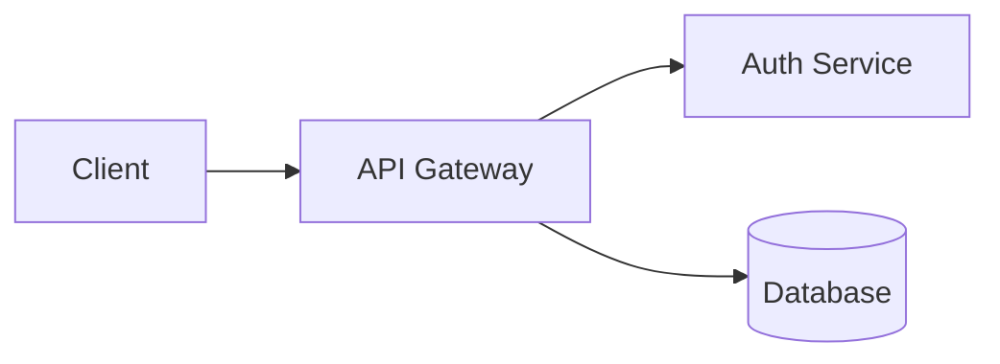

# Slide Format Reference

## Document Structure

```markdown
---
title: My Talk Title
author: Jane Developer
date: 2026-02-27
---

# First Slide

---

# Second Slide
```

**Frontmatter** (optional) goes at the very top between `---` fences. Supported
fields: `title`, `author`, `date`, `aspectRatio`, plus arbitrary key/value pairs.

**Slide separators** — a line containing only `---`, `***`, or `___` (three or
more characters). Blank lines around separators are optional but recommended.

## Per-Slide Metadata

HTML comment directives at the start of a slide set per-slide options:

```markdown
<!-- bg: #1a1a2e -->
<!-- layout: center -->
<!-- class: my-class -->
<!-- transition: fade -->

# Slide With Custom Background
```

| Directive | Values | Effect |
|-----------|--------|--------|
| `bg` | Any CSS color | Custom background color |
| `layout` | `default`, `center`, `two-column` | Content alignment |
| `class` | CSS class name | Extra class on the slide |
| `transition` | `fade`, `slide`, `none` | Slide transition |

## Markdown Features

### Typography

| Syntax | Renders As |
|--------|-----------|
| `# Heading` | Title — large with gold/green gradient underline |
| `## Heading` | Subtitle — muted tan |
| `### ` through `######` | Smaller headings |
| `**bold**` | **Bold** — cream, weight 600 |
| `*italic*` | *Italic* — green accent |
| `~~strike~~` | ~~Strikethrough~~ — muted with line-through |
| `` `code` `` | Inline code — mono font, green on dark bg |
| `> quote` | Blockquote — gold left border, italic |

### Lists

```markdown
- Unordered item          (gold bullet)
1. Ordered item           (gold number)
- [ ] Unchecked task      (styled checkbox)
- [x] Completed task      (gold checkbox with checkmark)
```

### Tables (GFM)

```markdown
| Feature | Status |
|---------|--------|
| Auth    | Done   |
| Export  | WIP    |
```

Tables get branded styling: gold header border, alternating row backgrounds.

### Images

```markdown

```

Images are responsive with rounded corners and a box shadow.

### Links

```markdown
[Docs](https://example.com)
```

URLs are also auto-linked by GFM.

### Emojis

Shortcodes like `:rocket:`, `:tada:`, `:sparkles:` are converted to unicode.

## Code Blocks

Fenced code blocks are syntax-highlighted with Shiki. Specify the language after
the opening fence:

````markdown
```typescript
function greet(name: string): string {
  return `Hello, ${name}!`
}
```
````

**Supported languages:** typescript, javascript, tsx, jsx, python, rust, go,
java, c, cpp, csharp, ruby, swift, kotlin, bash, shell, json, yaml, toml, html,
css, sql, graphql, markdown, dockerfile, plaintext.

### Code Annotations

Add comment annotations at the end of any line inside a code block:

| Annotation | Effect |
|------------|--------|
| `// [!code ++]` | Green diff — line added |
| `// [!code --]` | Red diff — line removed |
| `// [!code highlight]` | Gold highlight on the line |
| `// [!code focus]` | Focus this line, dim all others |
| `// [!code error]` | Red error highlight |
| `// [!code warning]` | Gold warning highlight |

**Diff example:**

```typescript
const greeting = 'hello' // [!code --]
const greeting = 'hi'    // [!code ++]
```

**Focus example** (unfocused lines are dimmed):

```typescript
const config = loadConfig()
const server = createServer(config) // [!code focus]
server.listen(3000)
```

## Mermaid Diagrams

Use `mermaid` as the language identifier to render diagrams. All Mermaid v11
diagram types are supported (flowcharts, sequence, class, state, ER, gantt,
pie, etc.). Diagrams are automatically themed to match the brand palette.

````markdown

````

## Adding a New Deck

Create a new directory under `presentations/` with a `slides.md` file:

```
presentations/
  my-new-talk/
    slides.md
```

The directory name becomes the deck ID. The deck is auto-discovered at build
time — no registration needed.
